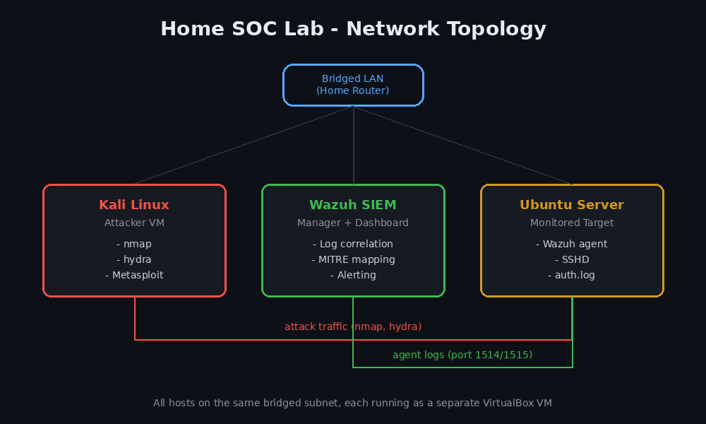
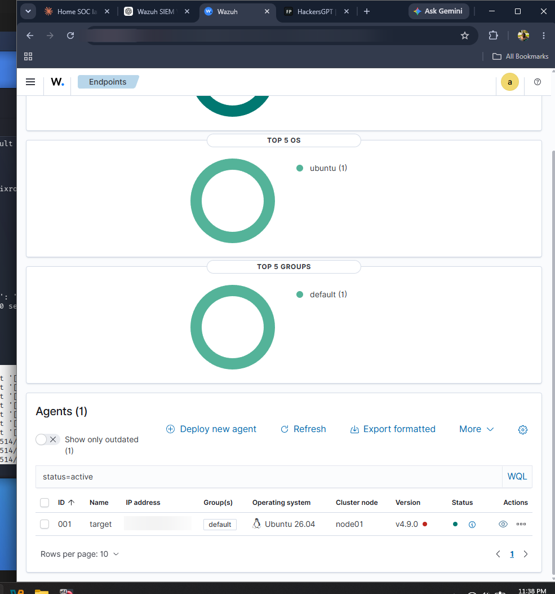
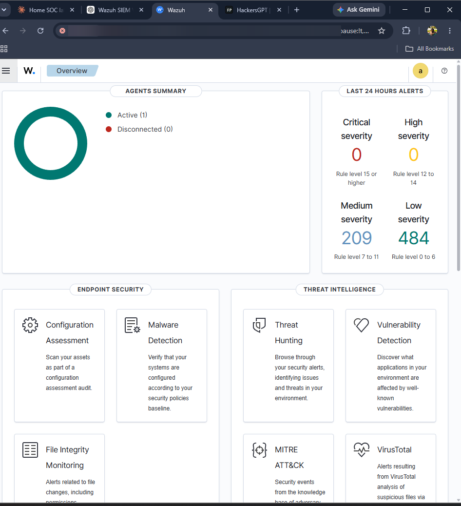
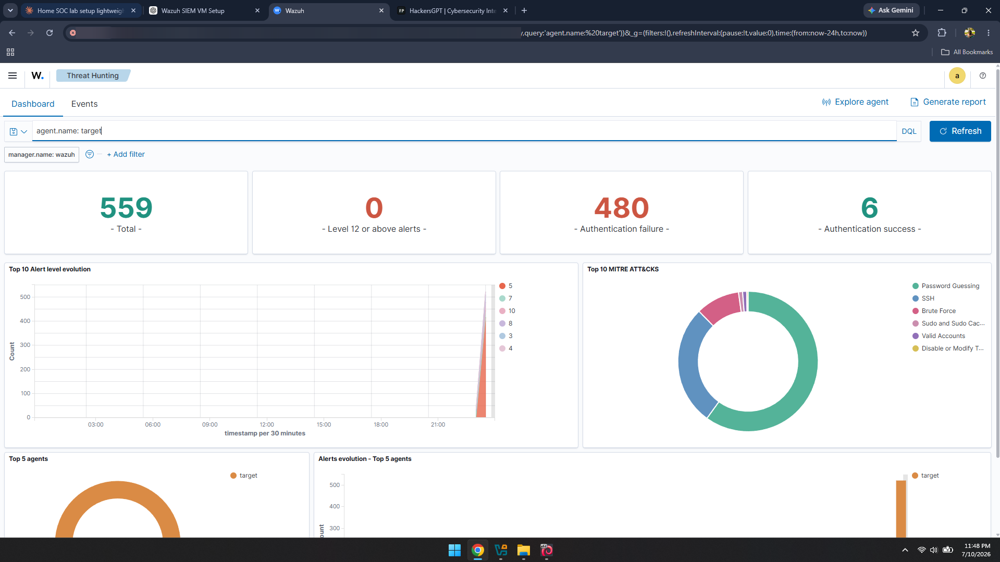
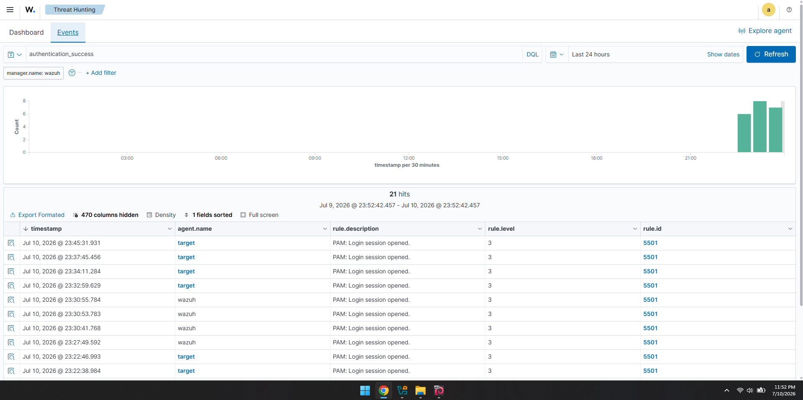
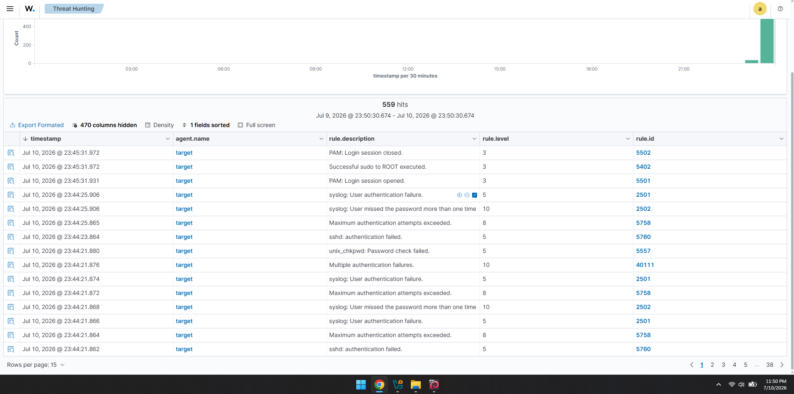

# Home SOC Lab

I built this lab to actually learn how SOC detection works instead of just reading about it. I'm trying to break into cybersecurity as an entry level SOC analyst, and the best way I know to actually understand alerts, logs, and detection rules is to set up my own environment, attack it myself, and see what shows up on the other side.

Everything here is real. No cloud shortcuts, no pre-built templates. I ran into a bunch of actual problems while setting this up (firewall misconfig, enrollment failures, SSH rate-limiting fighting back against my own attacks) and I documented those too, because troubleshooting is honestly half of what a SOC analyst does anyway.

**Started:** July 10, 2026
**Status:** Active, adding new exercises regularly

## Architecture



Three VMs on the same bridged network, so they behave like real hosts on a LAN rather than isolated boxes:

- **Wazuh SIEM** (manager + dashboard): this is where all the logs land and get correlated into alerts
- **Kali Linux**: the attacker box, used to generate real traffic to detect
- **Ubuntu Server**: the monitored endpoint, running the Wazuh agent

I originally tried Internal Network mode in VirtualBox to keep things isolated, but switched to bridged so the machines would behave more like a real network segment.

## Getting the agent connected (July 10)

This wasn't as simple as installing and walking away. The agent kept failing to enroll with the manager (`Unable to connect to enrollment service`), and it took some digging through `ossec.log` and checking listening ports with `ss -tulnp` to confirm the manager was actually reachable before it finally connected. Ping and basic connectivity were fine the whole time. It just needed a retry cycle to complete enrollment properly.



## Exercise 1: Nmap scan (July 10)

Ran a basic service detection scan from Kali:
```
nmap -sV 10.132.159.111
```
Found SSH open, running OpenSSH 10.2p1 on Ubuntu. Nothing dramatic here, but it's the first real check that the target is reachable and confirms what's exposed to an attacker.

## Exercise 2: SSH brute force with Hydra (July 10)

```
hydra -l root -P /usr/share/wordlists/rockyou.txt -t 4 ssh://10.132.159.111
```

This one didn't go the way I expected. OpenSSH's own rate limiting kicked in almost immediately and started dropping Hydra's connections outright. Hydra actually threw `[ERROR] all children were disabled due too many connection errors` before it could get far into the wordlist.

Even though the attack got throttled, Wazuh still caught everything:



- **468 authentication failure events** logged and correlated
- Automatically mapped to MITRE ATT&CK techniques: Password Guessing, Brute Force, SSH
- Alert levels ranged 5 to 10 (medium severity)



### Checking my own work

The dashboard also showed 21 "authentication success" events, and before writing this up as a clean result I wanted to make sure I wasn't missing an actual compromise. I went into the events and checked what those really were.



Every single one was rule 5501, "PAM: Login session opened," which is just normal login session activity from my own admin sessions on the Wazuh and target boxes. None of it was related to the Hydra attempt. Good reminder that a dashboard total on its own doesn't tell the full story, you have to actually open the events and check the source before reporting anything as a finding.



## What I learned

- Rate limiting on a target can mess with attack tools in ways that end up making for a more interesting detection story than a clean successful brute force would have
- Wazuh's default ruleset picks up SSH auth failures without any custom rule writing, and MITRE mapping happens automatically
- Alert totals need to be checked against actual event details before drawing conclusions. The 21 "successes" almost got misreported as something they weren't

## What's next

- Adding a Windows endpoint with Sysmon for richer telemetry (process creation, registry changes)
- Trying Splunk alongside Wazuh to compare workflows across SIEM platforms
- More exercise types: file integrity monitoring, a malware detection test (EICAR), maybe a privilege escalation attempt
- Suricata for network level detection alongside the log based detection Wazuh already covers

## Notes

I'm updating this repo as I go instead of dumping it all at once, since the point of this project is to show the actual process of learning detection engineering, not just a finished result.
